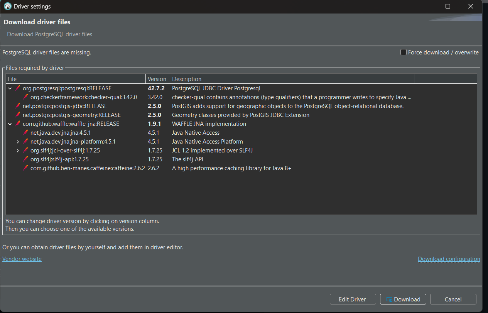
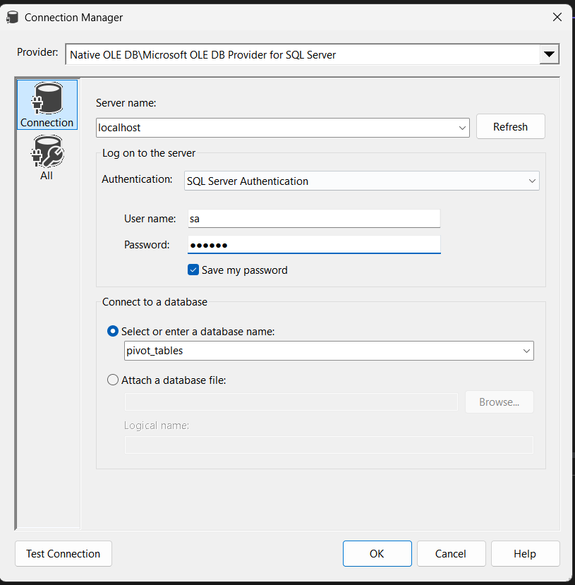
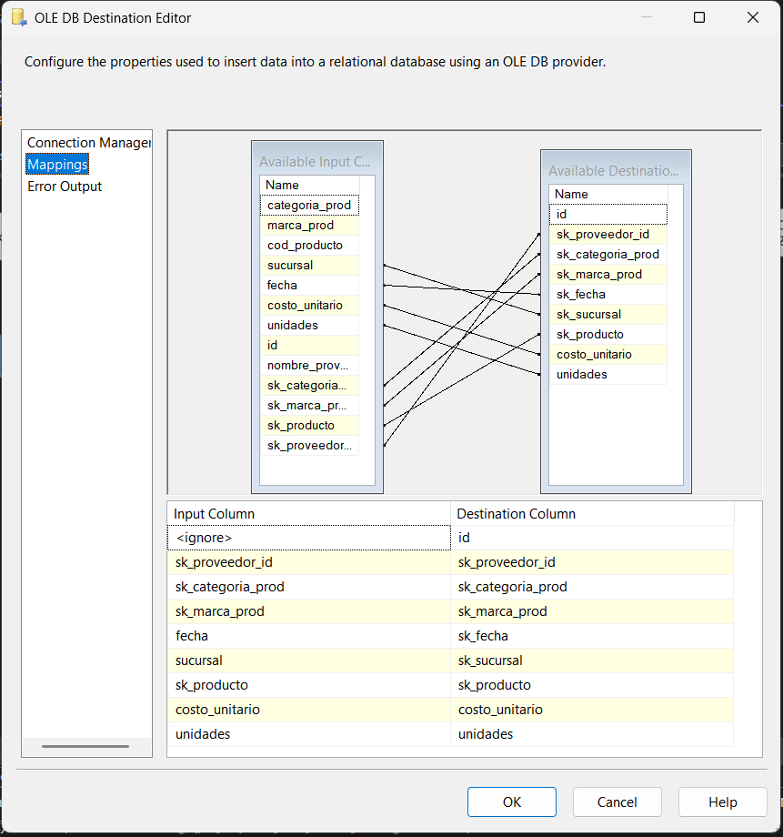

# Configuracion del Ambiente de desarrollo
Se utilizo `Microsoft Visual Studio Community 2022 (64-bit) - Current Version 17.13.2` desde donde se descargo la extension de `SSIS`

Las bases de datos se crearon localmente. SQL Server se creo con 

```
docker run -e "ACCEPT_EULA=Y" -e "MSSQL_SA_PASSWORD=abcdeF1+" \
-p 1433:1433 --name sql1 --hostname sql1 \
-d \
-v 'C:\Users\Juan Enrique\seminario2\lab\project1\ArchivosdeentradaProyecto':/home:rw \
mcr.microsoft.com/mssql/server:2022-latest
```

Si se quiere correr los queries desde el contenedor acceder a la terminal del contenedor y correr

```
/opt/mssql-tools18/bin/sqlcmd -S localhost -U sa -P "abcdeF1+" -No
```

PostgresSQL se creo con

```
docker run --name seminario_postrgres -d \
	-e POSTGRES_USER=edgar \   # if not set default value will be used, "postgres"
	-e POSTGRES_PASSWORD=1234567A \
	-e POSTGRES_DB=edgar \ # if not set value will be the same as "POSTGRES_USER"
	-p 5432:5432 \
	-v 'C:\Users\Juan Enrique\seminario2\lab\project1\ArchivosdeentradaProyecto':/home:rw \
	postgres
```

Notar que los contenedores se crean con un volumen el cual apunta a la carpeta que contiene los archivos de entrada ya que estos deben existir dentro del contendor para poder ejecutar la tool `SQL Task` que va a realizar el bulk insert a las tablas pivote usando un comando SQL para esto

# Crear Tablas Pivote
En un administrador de bases de datos conectarse al contenedor, yo use Microsoft SQL Server Management Studio, y ejecutar este [script](../SQLServer/Pivot/DataDefinitionLanguage/pivot_ddl.sql)


Para Postgres utilice DBeaver, probablemente tengas que instalr los Drivers para postgres pero DBeaver deberia indicarte si hace falta y ejecuta el [script](../PostgresSQL/data_definition_language/pivot_tables_ddl.sql) para PostgresSQL




# Crear un Proyecto
En Microsoft Visual Studio crear un nuevo proyecto que se de SSIS usando la primera opcion en pantalla


# Control Flow
Este es el flow principal, desde aqui hare los "bulk insert", me desviare a otro flujo para insertar los datos a las dimensiones y a una tabla pivote para cada hecho y despues en otro flujo insertare a la tabla de hechos, esto se hace asi porque si estuviera todo dentro de un mismo flujo nada garantiza que las tablas de las dimensiones se llenen antes que la tablas de los hechos lo que resultaria en un error debido a las `FOREIGN KEY`s. El flow es practicamente igual para limpiar, extraer, insertar y todas las tranformaciones en todas las fuentes de datos, SQL Server y Postgres.

## Crear Conexion a DB
Estas conexiones se hacen a la bases de datos que contienen las tablas pivote. 

### SQL Server
Hacer click derecho en la parte de abajo de "Connection Manager" y seguir los pasos.


Debe ser OLE DB



### PostgtesSQL
Se debe [descargar](https://www.enterprisedb.com/downloads/postgres-postgresql-downloads) PostgresSQL, yo utilice la version `17.4`, instalar solo lo que se indica(Command Line Tools) ya que se esta utilizando Docker


Abrir ODBC Data Store Administrator y crear un nuevo data source


Como estoy usando Docker solo instalar los Drivers. Volver a crear una conexion pero esta vez hacer click en `New Connection` dentro de "Connection Manager" y crear una conexcion `ODBC`


## Insertar a Tablas Pivote
Primero debo aclarar que no pude instalar SQL Server localmente ya que el tamaño del bloque debe ser modificado si se instala sobre sistemas de almcenamiento modernos pero esto implica ciertos riesgos por lo que opte por correr SQL Server en Docker. Pero esto implica para ambas bases de datos que no podre usar el tool llamado "Buik Insert Task" porque el archivo que quiero insertar no existe en el contexto que esta ejecutando los servidores de la base de datos, en este caso son maquinas virtuales, y en lugar hare uso de el tool "SQL Task" que permite ejecutar commandos SQL usando una conexion que sera del tipo `OLE DB` para SQL Server y `ODBC` para PostrgresSQL

1. Truncar/limpiar las tablas pivote, esto se hace para que se pueda ejecutar todo el flujo repetidas veces llenando la tabla pivote multiples veces, entonces se vacian antes de volver a llenarlas usando un `SQL TASK`


2. Insertar las compras y ventas con un `SQL TASK`


## Insertar a Las Tablas de Dimensiones y Pivote Hechos
Despues de insertar a las tablas pivote ambas lineas de tareas(SQL Server y Postgres) se unen en un `Data Flow Task` para insertar a las tablas de dimensiones y tablas pivote de los hechos, aunque se pudo hacer por separado, osea cada tipo de conexion en su propio flujo, hacerlo asi nos evita duplicar el uso de algunas tareas justo antes de insertar a las tablas de dimensiones, por ejemplo algunas tools como `Data Conversion` en la dimension fecha, `Agregate`s que se usan para hacer `GROUP BY` que nos permite elimnar duplicados, `Lookup`s que nos permiten buscar en las tablas antes de insertar y saber que datos ya existen en las tablas para evitar errores, util en caso que todo el pipe se corra varias veces por alguna razon. Antes de hacer la insercion se transformaran los datos ya que en la tabla pivote son texto puro.

### Leer Tablas Pivote y Archivo CSV
Se usa un `OLE DB Source`, `ODBC Source` para SQL Server y Postgres respectivamente, en OLE DB se lee directo de la tabla(sin usar query) y en ODBC usaremos un query para leer las tablas


#### Archivo CSV
Utilizar un `Flat File Source`, crear una conexion flat al archivo, Code page sera `65001` para conserver tildes y caracteres especiales


Asegurarse que los campos tenga los bits suficientes para guardar el string


Antes de unir estas tres fuentes tenemos que transformar la info del flat file para que tenga el mismo "code page", en este caso queremos que tenga el que se usa por default "Latin 1252" de esta manera mantendremos los caracteres especiales y la metadata sera igual a las demas fuentes, esto nos permitira unirlas, si la metadata no es igual, no se pueden unir las filas

Utilicé `Derived Column` para hacer esta transformacion. En esta ocasion tuve cuidado que el numero de bytes que las columnas usan sean iguales a las de las tablas de dimensiones y hechos donde los guardare


Unir las fuentes, otra vez es importante que la metadata sea igual sobre todo los tipos, el lenght no tiene que ser exactamente igual pero si uno es mas grande que el otro podria ocurrir truncacion y esto sera considerado un error o se puede ignorar, pero para no perder informacion usé suficientes bits


### Estandarizar Datos
Usando `Derived Column` stadandarizaremos:

1. Eliminaremos el uso de `"` y `'`, comillas doble y simples, Todos los valores de texto usaran minusculas y eliminare espacios en blanco al incio y al final de todas las columnas que seran guardadas como texto

2. En el "codigo de proveedor" los nulos y vacios se sustituiran con el valor por defecto "0000". Para poder utilizar este valor como llave primaria numerica se removera la primera letra del codigo(Todos los codigos de proveedor tienen una P al inicio, no tiene sentido hacerlo alfa numerico)

3. El "codigo de producto" se sustituiran vacios y nulos con el valor por defecto "PR00000", aqui si hay que conservar el valor alfa numerico

4. En la "marca de producto" valores nulos y vacios seran por defecto "sin marca".

5. En la "categoria" valores nulos y vacios seran por defecto "sin categoria".

6. En el "codigo de sucursal" removere la primera letra y dejare solo los numeros para usarlo como un primary key, no sera necesario conservarlo como alfa numerico

7. En la "direccion sucursal" valores nulos y vacios seran por defecto "sin direccion"
 
8. En la "region" valores nulos y vacios seran por defecto "sin region"

9. En el "departamento" valores nulos y vacios seran por defecto "sin departamento"

10. En el "codigo de cliente" para los nulos y los vacios el valor por defecto sera "0000", ademas para poder usar este valor como llave primaria numerica removere la letra inicial

11. El "tipo de cliente" sera asignado "min" para Minorista y "may" para Mayorista

12. En el "numero de cliente" valores nulo o vacios seran cero por defecto

13. En el "codigo vendedor" removere la primera letra para poder usar el valor como numerico en una llave primaria y los valores vacios o nulos tendran por defecto "0000"

14. En "vacacionista" se sustituira 1 por "vacacionista" y cualquier 0 por "fijo", nulos y vacios seran "indefinido" esto nos cubrira los nulos y valores no validos y esto se insertara en una columna nueva llamada "TipoVendedor", este cambio se hace para mejorar la legibilidad del analisis.(me confundi en la implementacion, arreglar despues)


### Parseo de Tipos
Ahora que el texto esta formateado podemos transformar de texto al tipo que corresponda para poder insertar el tipo adecuado a las tablas de dimensiones usando un `Data Conversion`, para poder hacer este mapeo se debe utilizar el modelo fisico(modelo de constelacion) de los datamarts para ver el tipo que necesita cada columna en las dimensiones. `four-byte signed integer [DT_I4]` mapea a `INTEGER`, `numeric [DT_NUMERIC](18, 2)` mapea a `DECIMAL(18,2)`, `Unicode string [DT_WSTR]` mapea a `NVARCHAR`, recordar que `NVARCHAR` puede guardar caracteres unicode y tener cuidado con el numero de bytes para evitar truncar el contenido


### Recuperacion de Datos
Al momento de parsear de texto al tipo deseado posiblemente tendremos errores, para manejarlos hay que conectar el canal de error del `Data Conversion` a otra accion, en este caso un script de C# usando un `Script Component`, aqui solo elegimos que columnas seran nuestro input y click en "Edit Script"

Debemos analizar los errores y determinar que acciones tomar, en este caso haremos lo siguiente:

1. El costo de unidad en las compras se limpiaran cualquier caracter no numerico que no sea `.`, si esta vacio o nulo el valor sera 0

2. El numero de proveedor y unidades compradas se removera valores no numericos y si resulta en un valor vacio y/o nulo aignaremos 0

3. La fecha la formateamos para asegurarnos que no sea un problema de formato y si hay problemas construyendo un objeto tipo fecha asignamos una fecha por defecto de "01-01-0001"


#### Parsear Datos Recuperados
Se vuelven a correr las mismas transformaciones de tipos anteriormente realizadas

#### Unir Datos Parseados
Se unen los datos en un `Union All`

#### Fecha(caso especial)
Vamos a generar el ID de la fecha y los valoes de la dimension fecha, nos interesa hacerlo antes de la union porque queremos que el ID de fecha de cada registro que se va a generar podamos insertarlo en la tabla pivote de hechos y para eso uso un `Derived Columns`


### Direccionar Flujo
Usaremos `Multicast` para poder usar el mismo flujo de datos en lineas de tareas diferentes.

### Insertar a las Dimensiones
Practicamente la insercion de informacion a todas las dimensiones siguen el mismo proceso o uno demasiado similar a excepcion de "fecha" que tiene una transformacion de tipo de numerico debido al diseño fisico de esta dimension, "proveedor" en el que le creamos un ID numerico con un script a cada entrada que tenga un ID valor 0 usando una variable `static` para llevar el conteo en un script de C#

#### Eliminar Duplicados
Agrupamos registros que sean iguales para eliminar duplicados con un `Aggregate`


#### Unir Ambos Lado(compras y ventas)
En un `Union All` ahora deberia ser muy facil unirlas, solo mapear bien

#### Verificar Existencia
Veririficar en la tabla de dimesiones que los datos que se quieren insertar todavia no existan usando `Lookup`, esto evitara errores como de querer insertar una llave primaria que ya exista


#### Insertar
Se insertan los valores ya sin duplicar y correctamente formateados a su tabla respectiva usando `OLE DB Destination`


### Insertar a Los Pivotes de Los Hechos
#### Verificar Existencia
Veririficar en la tabla pivote que los datos que se quieren insertar todavia no existan usando `Lookup`, esto evitara errores como de querer insertar una fila que ya exista


#### Insertar
Usando `OLE DB Destination` insertar a su respectivo pivote


## Insertar a Tablas de Hechos
En un `Data Flow Task` diferente se lee de los pivotes y se inserta a los hechos, el proceso es casi igual para las compras y ventas

### Obtener Los Datos
Leer las tablas pivote con un `OLE DB Source`

### Ordenar
Es un requisito ordenar los datos para poder unir las columnas con las columnas con llaves surrogadas(FOREING KEYs) que van a mapear a una tabla de dimensiones. Ordenamos por `id`, este fue generado automaticamente por insert a la tabla pivote

### Direccionar Flujo
Usaremos `Multicast` para poder usar el mismo flujo de datos en lineas de tareas diferentes.

### Mapear
Ahora mapeamos cada columna que representa un valor en una dimension, en el caso de compras mapeamos "Categoria", "Marca", "Producto", "Proveedor", y en el caso de ventas "Categoria", "Marca", "Producto", "Vendedor", "Tipo Cliente", esto generara nuevas columnas con las llaves surrogadas. El id de la fecha ya esta en una columna del pivote. Aqui usamos un `Lookup` para indicar que columna nos va a vincular y que columna de la dimension queremos seleccionar cuando encuentre un match, en este caso la columna a selecionar siempre seria la llave primaria en la dimension


### Fusionar(Merge)
Solo se puede fusionar dos tablas al mismo tiempo y tienen que estar ordenadas como indicamos anteriormente. 


### Verificar Existencia
Veririficar en la tabla de hechos que los datos que se quieren insertar todavia no existan usando `Lookup`, esto evitara errores como querer insertar una llave primaria que ya exista


### Insertar
Insertar usando un `OLE DB Destination`




# Conflictos
En las tabla de vendedores resultamos con estos datos los cuales debemos analizar como tratar en una segunda iteracion posiblemente pero nos podrian servir para detectar problemas de las aplicaciones cliente o del recurso humano, etc.

| id_codigo | Nombre | tipo |
| -------- | ------ | ---- |
| 12 | carlos daniel cabrera sosa | indefinido |
| 12 | carlos daniel cabrera sosa | vacacionista |
| 28 | sergio dardo artola naranja | vacacionista |
| 28 | favio daniel caamazo  vernay | vacacionista |
| 37 | fernando benitez caorsi | fijo |
| 37 | fernando benitez caorsi | vacacionista |
